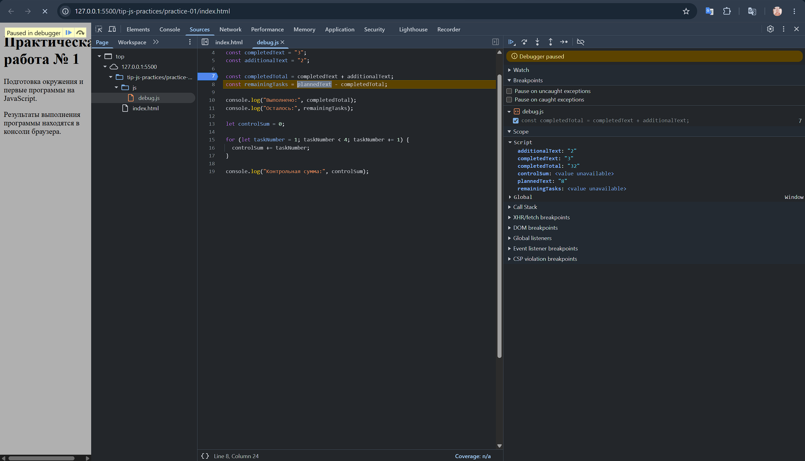
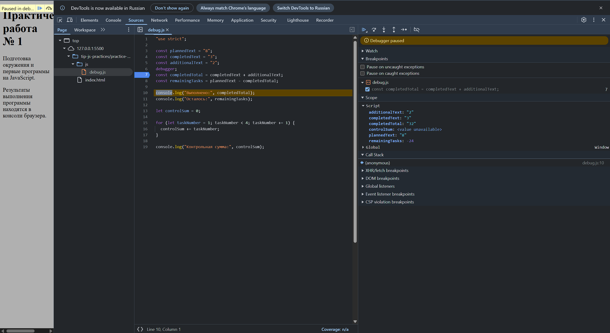

# Практическая работа № 1

## 1. Автор и вариант

**Автор:** Максим  
**Группа:** ЭФБО-04-25  
**Вариант:** 5

---

## 2. Окружение

**Операционная система:** Windows 11 Домашняя  
**Версия Node.js:** v24.21.0  
**Версия npm:** 11.19.0  
**Версия Git:** 2.55.0.windows.5  
**Использованный браузер:** Google Chrome  

---

## 3. Запуск

Команды выполняются из корня репозитория `tip-js-practices`.

### Запуск через Node.js

```bash
node practice-01/js/hello.js
node practice-01/js/types.js
node practice-01/js/progress.js
node practice-01/js/plan.js
node practice-01/js/debug.js
```

### Запуск в браузере

Для запуска в браузере необходимо открыть `practice-01/index.html`, заменить путь в `script` на нужный файл, сохранить изменения, перезагрузить страницу и посмотреть результат в `Console`.

Например:

```html
<script src="./js/hello.js" defer></script>
```

Для запуска другого файла нужно поменять путь, например:

```html
<script src="./js/types.js" defer></script>
```

---

## 4. Задание 1

### Файл `hello.js` был запущен двумя способами

1. Через Node.js в консоли VS Code через команду:

```bash
node practice-01/js/hello.js
```

2. Через `index.html`.

### Вывод результата

При запуске через Node.js вывод появился в терминале VS Code.  
При запуске в браузере вывод появился в `Console` инструментов разработчика.

### Обоснование

В браузере `typeof document` возвращает `object`, потому что браузер предоставляет объект `document`, представляющий HTML-документ.

В Node.js `typeof document` возвращает `undefined`, потому что Node.js не работает с HTML-страницей и объекта `document` там нет.

---

## 5. Задание 2

| Выражение | Ожидание до запуска | Фактическое значение | Тип результата | Объяснение |
|---|---|---|---|---|
| `"8" + 2` | 82 | 82 | `string` | из-за оператора `"+"` и если есть `string`, то `2` преобразуется в `string` и происходит склейка строк |
| `"8" - 2` | `NaN` | 6 | `number` | у `"-"` нет другой функции как склейка у `"+"`, поэтому арифметика: `"8"` → `8`, `8 - 2 = 6` |
| `Number("8") + 2` | 10 | 10 | `number` | `Number("8") = 8`, `8 + 2 = 10` |
| `"12" > "3"` | `false` | `false` | `boolean` | обе величины являются строками, поэтому сравнение идёт как строк: первый символ `"1"` меньше `"3"` |
| `12 === "12"` | `false` | `false` | `boolean` | разные типы данных |
| `Number("")` | 0 | 0 | `number` | пустая строка и пробелы переводятся в `0` |
| `Number("text")` | `NaN` | `NaN` | `number` | текст переводится в `NaN` |
| `Boolean("false")` | `true` | `true` | `boolean` | непустая строка преобразуется в `true` |
| `typeof null` | `null` | `object` | `string` | особый случай: `typeof null` возвращает `"object"` |
| `typeof NaN` | `number` | `number` | `string` | особый случай: `typeof NaN` возвращает `"number"` |

---

## 6. Задание 3

### Сводка выполнения задач


### Проверки

| Проверка | Входные данные | Ожидаемый результат | Фактический результат | Итог |
|---|---|---|---|---|
| Обычный случай | `12`, `5` | Осталось 7, прогресс 41.7%, статус «В работе» |  | Пройдено  |
| Задач нет | `0`, `0` | Задач пока нет |  | Пройдено  |
| Ничего не выполнено | `5`, `0` | Осталось 5, прогресс 0.0%, статус «Не начато» |  | Пройдено  |
| Все задачи выполнены | `5`, `5` | Осталось 0, прогресс 100.0%, статус «Завершено» |  | Пройдено  |
| Выполнено больше, чем существует | `5`, `6` | Ошибка |  | Пройдено  |
| Отрицательное количество | `-1`, `0` | Ошибка |  | Пройдено  |
| Дробное количество | `5`, `2.5` | Ошибка |  | Пройдено  |
| Вместо числа строка | `"5"`, `2` | Ошибка |  | Пройдено  |
| Превышена верхняя граница | `1001`, `0` | Ошибка |  | Пройдено  |
| `NaN` | `NaN`, `0` | Ошибка |  | Пройдено  |
| Свой вариант | `[totalTasks]`, `[completedTasks]` | Зависит от варианта |  | Пройдено  |

---

## 7. Задание 4

### План выполнения задач по дням


### Проверки

| Проверка | Входные данные | Ожидаемый результат | Фактический результат | Итог |
|---|---|---|---|---|
| Обычный случай | `12`, `5`, `3` | 3 дня, в последний день выполнена 1 задача | Осталось 7; день 1 — выполнено 3, осталось 4; день 2 — выполнено 3, осталось 1; день 3 — выполнено 1, осталось 0; потребуется 3 дня | Пройдено |
| Проверка 2 | `10`, `4`, `3` | 2 дня, по 3 задачи в день | Осталось 6; день 1 — выполнено 3, осталось 3; день 2 — выполнено 3, осталось 0; потребуется 2 дня | Пройдено |
| Проверка 3 | `5`, `3`, `10` | 1 день, выполнено 2 оставшиеся задачи | Осталось 2; день 1 — выполнено 2, осталось 0; потребуется 1 день | Пройдено |
| Все задачи выполнены | `5`, `5`, `2` | 0 дней, цикл не выполняется | Все задачи уже выполнены; потребуется 0 дней | Пройдено |
| Задач нет | `0`, `0`, `2` | 0 дней, цикл не выполняется | Все задачи уже выполнены; потребуется 0 дней | Пройдено |
| Нулевой лимит | `5`, `2`, `0` | Ошибка, цикл не запускается | Ошибка: dayLimit вне диапазона [1...1000] | Пройдено |
| Дробный лимит | `5`, `2`, `1.5` | Ошибка: дробной дневной нормы быть не должно | Ошибка: некорректное количество задач или введены не целые положительные числа | Пройдено |
| Выполнено больше, чем существует | `5`, `6`, `2` | Ошибка: некорректное число выполненных задач | Ошибка: некорректное количество задач или введены не целые положительные числа | Пройдено |
| Лимит задан строкой | `5`, `2`, `"2"` | Ошибка: дневная норма задана строкой | Ошибка: некорректное количество задач или введены не целые положительные числа | Пройдено |
| Лимит больше 1000 | `5`, `2`, `1001` | Ошибка: превышена верхняя граница нормы | Ошибка: dayLimit вне диапазона [1...1000] | Пройдено |
| Свой вариант | `7`, `2`, `2` | 3 дня: день 1 — выполнено 2, осталось 3; день 2 — выполнено 2, осталось 1; день 3 — выполнено 1, осталось 0 | Осталось 5; день 1 — выполнено 2, осталось 3; день 2 — выполнено 2, осталось 1; день 3 — выполнено 1, осталось 0; потребуется 3 дня | Пройдено |

## 8. Отладка

В файле `debug.js` были две логические ошибки.

### Исходный результат

До исправления программа выводила:

```text
Выполнено: 32
Осталось: -24
Контрольная сумма: 6
```

### Поиск ошибок через DevTools

Сначала была поставлена точка останова на строке:

```js
const completedTotal = completedText + additionalText;
```

В `Scope` было видно, что `completedText` и `additionalText` имеют значения `"3"` и `"2"` и являются строками.

После выполнения этой строки значение `completedTotal` стало `"32"`, потому что оператор `+` выполнил склейку строк, а не сложение чисел.

Далее была проверена работа цикла. Значение `taskNumber` изменялось от `1` до `3`, поэтому число `4` в сумму не попадало.

### Исправление

Для первой ошибки строки были преобразованы в числа:

```js
const completedTotal = Number(completedText) + Number(additionalText);
```

Для второй ошибки условие цикла было изменено:

```js
for (let taskNumber = 1; taskNumber <= 4; taskNumber += 1)
```

### Результат после исправления

```text
Выполнено: 5
Осталось: 3
Контрольная сумма: 10
```

### Таблица ошибок

| Ошибка | Что наблюдалось | Причина | Исправление | Результат после исправления |
|---|---|---|---|---|
| Обработка количества задач | `completedTotal` получал значение `"32"`, а остаток был `-24` | Значения `"3"` и `"2"` были строками, поэтому оператор `+` выполнил склейку | Использовано преобразование через `Number()` | Выполнено `5`, осталось `3` |
| Граница цикла | Контрольная сумма была `6` | Условие `taskNumber < 4` не включало значение `4` | Условие изменено на `taskNumber <= 4` | Контрольная сумма стала `10` |

### Скриншоты отладки

#### Скриншот 1



#### Скриншот 2



---

## 9. Вывод

В ходе практической работы было подготовлено окружение для запуска JavaScript через Node.js и браузер.

Были изучены типы данных, преобразование типов, условия и циклы. Также была выполнена проверка входных данных и рассмотрена отладка JavaScript через DevTools с использованием точек останова.

Наиболее показательной ошибкой была работа оператора `+` со строками. Значения `"3"` и `"2"` складывались как строки и давали `"32"`, а после преобразования через `Number()` результат стал равен `5`.

Также была исправлена граница цикла, из-за которой значение `4` не учитывалось при расчёте контрольной суммы.